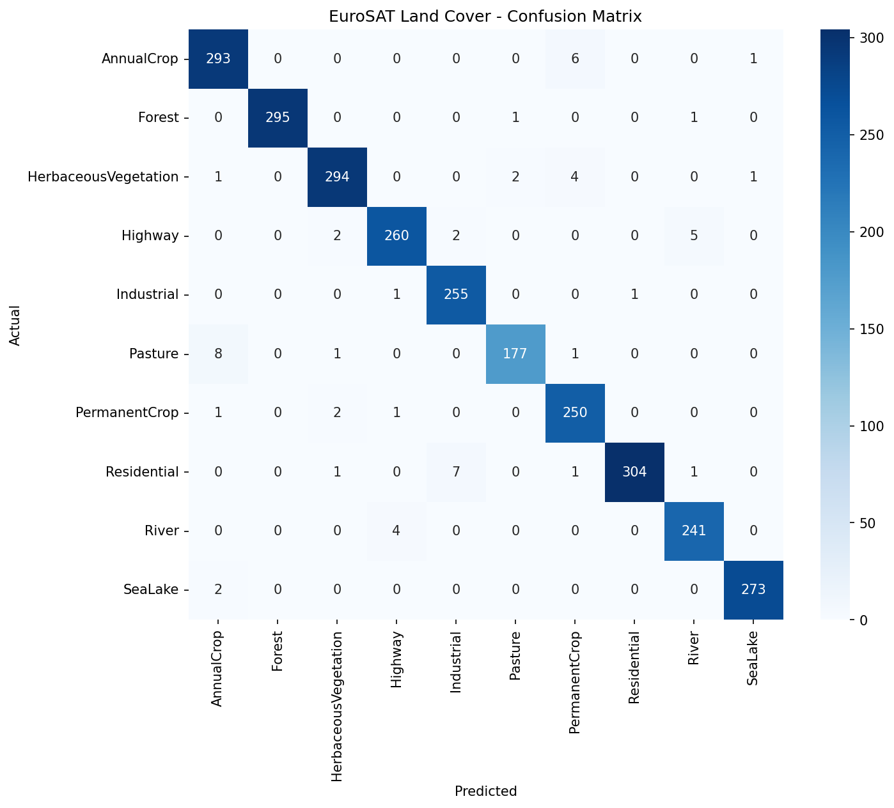

# EuroSAT Land Cover Classifier

> *"Sometimes you gotta run before you can walk."*, built a satellite-image intelligence system from the ground up.

A convolutional neural network that looks at a satellite image and tells you what kind of land it is whether it is a forest, river, farmland, city, or 6 other more. Built with **ResNet50 transfer learning** on the **EuroSAT** dataset and fine-tuned to **97.85% test accuracy** across 10 land-cover classes.


---

## Mission

Satellites photograph every inch of Earth on a loop, but raw imagery is useless until something can *read* it. This project trains a model to classify 64×64 patches of Sentinel-2 satellite imagery into 10 land-cover types, the foundational step toward automated tasks like deforestation monitoring, urban-growth tracking, and crop mapping.

Instead of training a neural network from scratch (millions of images, days of compute), this uses **transfer learning**: take ResNet50, which is a model that already learned to *see* from 14 million ImageNet photos, and re-teach only what it needs to know about land seen from space.

---

## Architecture

| Component | Spec |
|---|---|
| **Backbone** | ResNet50, pretrained on ImageNet (~25M parameters) |
| **Strategy** | Transfer learning → fine-tuning, in two stages |
| **Stage 1** | Freeze the backbone, replace the final layer (1000 → 10 classes), train only the head |
| **Stage 2** | Unfreeze the whole network, fine-tune all layers at a 10× lower learning rate |
| **Input** | 64×64 RGB → resized to 224×224, normalized with ImageNet stats |
| **Augmentation** | Random horizontal + vertical flips (training only) |
| **Optimizer** | Adam · CrossEntropyLoss |
| **Hardware** | Google Colab, NVIDIA T4 GPU |

**Why two stages?** Stage 1 quickly teaches the new classifier head using the backbone's existing "vision." Stage 2 gently lets the deeper layers specialize for satellite textures, for which is what pushed accuracy from ~94% to ~98%.

---

## The Data - EuroSAT

- **27,000** Sentinel-2 satellite images (European Space Agency)
- **64×64 pixels**, 10 m per pixel, RGB
- **10 classes**, split **80 / 10 / 10** → 21,600 train · 2,700 validation · 2,700 test

`AnnualCrop` · `Forest` · `HerbaceousVegetation` · `Highway` · `Industrial` · `Pasture` · `PermanentCrop` · `Residential` · `River` · `SeaLake`

---

## Performance Results

**Overall test accuracy: 97.85%** (on 2,700 held-out images the model never saw during training)

| Class | Precision | Recall | F1-score |
|---|---:|---:|---:|
| AnnualCrop | 0.961 | 0.977 | 0.969 |
| Forest | **1.000** | 0.993 | **0.997** |
| HerbaceousVegetation | 0.980 | 0.974 | 0.977 |
| Highway | 0.977 | 0.967 | 0.972 |
| Industrial | 0.966 | 0.992 | 0.979 |
| Pasture | 0.983 | 0.947 | 0.965 |
| PermanentCrop | 0.954 | 0.984 | 0.969 |
| Residential | 0.997 | 0.968 | 0.982 |
| River | 0.972 | 0.984 | 0.978 |
| SeaLake | 0.993 | 0.993 | 0.993 |
| **Accuracy** | | | **0.9785** |
| **Macro avg** | 0.978 | 0.978 | 0.978 |

<p align="center">
  
</p>

---

## Error Analysis

The model's mistakes are the *interesting* part, and they all make physical sense:

- **Pasture → AnnualCrop (8 errors):** the single biggest confusion, both are flat green ground cover, nearly identical from 10 m up.
- **Residential → Industrial (7):** both are built-up, blocky, grey-roofed human structures.
- **AnnualCrop → PermanentCrop (6)** and **HerbaceousVegetation → PermanentCrop (4):** the green vegetation classes naturally overlap.
- **Highway ↔ River (5 and 4):** both appear as long, thin features cutting across the landscape.

**Takeaway:** errors cluster between *visually similar* categories (green-on-green, built-on-built, line-on-line), exactly where a human analyst would hesitate too. The model is confident and correct on the visually distinct classes (Forest, SeaLake, Residential).

---

## How to run it yourself?

This was built and trained in **Google Colab** (free T4 GPU).

1. Open `eurosat_classifier.ipynb` in [Google Colab](https://colab.research.google.com).
2. Set **Runtime → Change runtime type → T4 GPU**.
3. **Runtime → Run all.** The dataset auto-downloads (~90 MB); training takes ~30 minutes end to end.

**To use the trained model directly** (skip training):

```python
import torch
from torchvision.models import resnet50
import torch.nn as nn

model = resnet50()
model.fc = nn.Linear(model.fc.in_features, 10)
model.load_state_dict(torch.load('best_model.pth', map_location='cpu'))
model.eval()

classes = ['AnnualCrop','Forest','HerbaceousVegetation','Highway','Industrial',
           'Pasture','PermanentCrop','Residential','River','SeaLake']
```

---

## Honest Log

The idea started from a tutorial I found online, and I used AI assistance for debugging. But I typed every line by hand, fought my own errors, and made sure I understood what each part does. This is my first end-to-end machine learning project. Every build starts somewhere.

*Part of the journey is the start.*

---

## Tech Stack

`PyTorch` · `torchvision` · `scikit-learn` · `matplotlib` · `seaborn` · `Google Colab`

**Dataset:** Helber et al., *EuroSAT: A Novel Dataset and Deep Learning Benchmark for Land Use and Land Cover Classification*, IEEE JSTARS, 2019.
